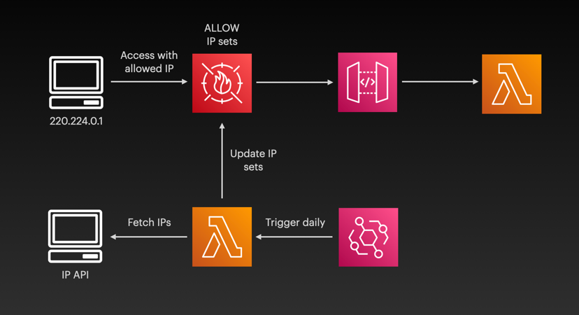

# auto-ip-waf

### A simple architecture for automating the update of IP sets in a WAF based on a schedule. 



### Verify IP Sets

```
aws waf-regional list-ip-sets
aws waf-regional get-ip-set --ip-set-id xxx-xx-xx-xx-xxx
```

### See Also

- See [AWS solution](https://github.com/aws-samples/aws-waf-ipset-auto-update-aws-ip-ranges) for SNS-triggered updates with WAF V2
